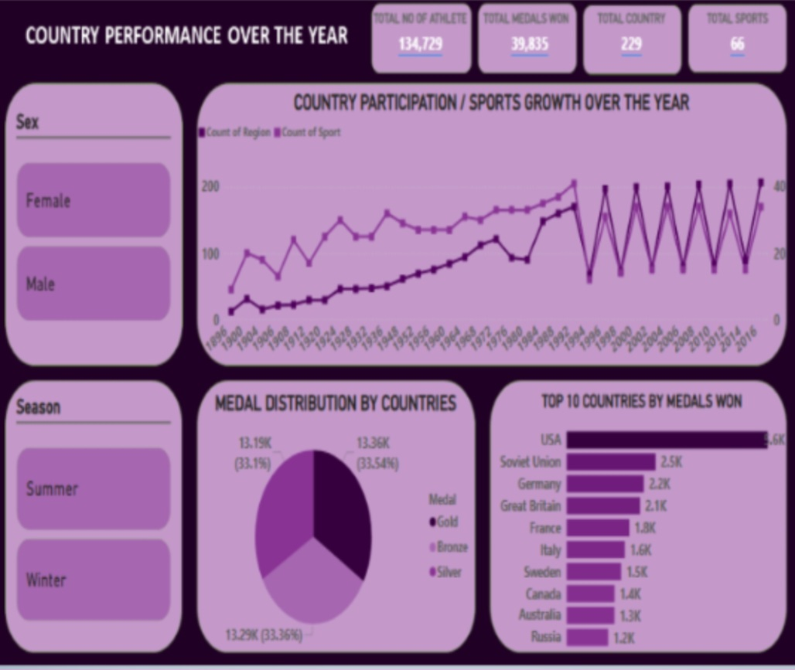
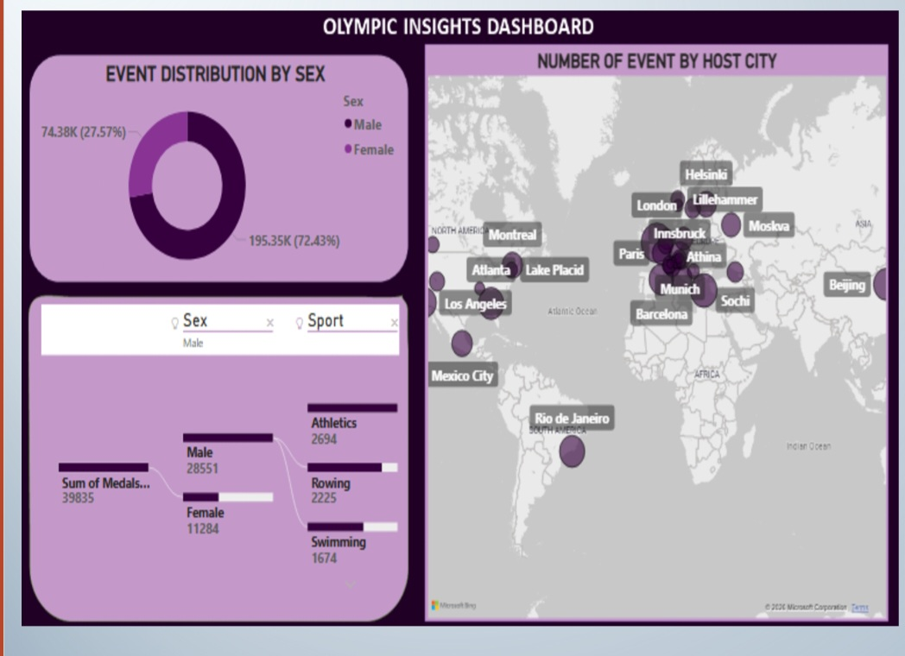
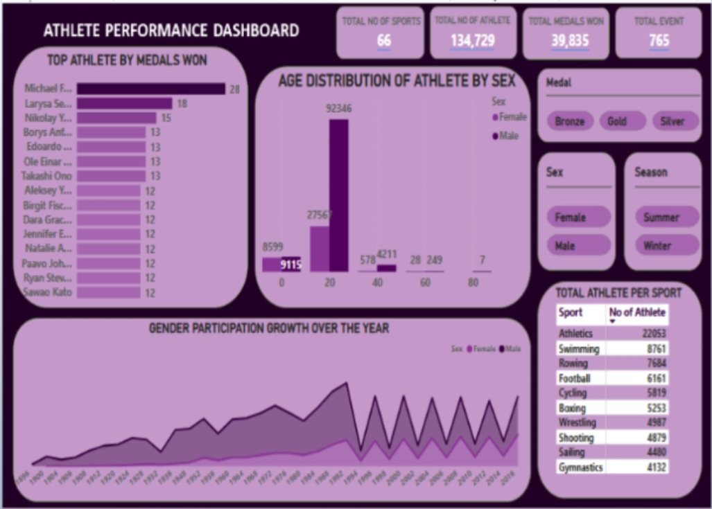

EXPLORATORY DATA ANALYSIS (EDA) REPORT
# Olympic Athlete Dataset

## Table of Contents 
- [Project Overview](#project-overview)
- [Exploratory data analysis](#exploratory-data-analysis)
- [Key Observations](#key-observations)

### project overview
This data analysis project contains historical olympic records of different athelete ( athelete name, sex, age, height, weight, country, medals won)  in different sports. The objective of this analysis is to assess data quality, handle inconsistent formatting, missing and duplicate records while also providing insight into athlete performance over the year.

### DATASET OVERVIEW
The primary dataset used for this analysis is "Olympic dataset"  file which contains detailed information about each athelete, games played and medals won. It is used to analyse their performance. Below is a detailed explanation of each column:

📊 Key Attributes:
    - Number of records in Athlete_events : 271,116 rows × 15 columns .
    - Number of records in NOC_Regions: 231 rows      × 3 columns.

📌 Key Variables:
    - Athlete name : names of Olympic athletes.
    - sex: gender of the athletes (Male, Female)
    - NOC: Country representation
    - Sports: Competition type.
    - Season: Period when the competition took place.
    - Medal: Quality of medals won(Gold, Silver,Bronze).
    
Data Types:
• Numerical: age, height, weight.
• Categorical: name, Sports, Events, Games,Medal,City, Region,Team,NOC, Sex, Season
• ID: Athlete_ID (Not used for analysis).

### Tools
- Excel - Prepared, transformed darabfor analysis using Excel.
PowerBI -  Created interactive dashboards to visualize athlete performance over the Olympic years using PowerBI

### Data cleaning/Preparation 
In the data preparation phase,I performed the following tasks :
1. Handling missing values. 
During the data review, I noticed missing values in key numerical columns which could impact the analysis if not properly addressed.
Missing values :
• Age : 9315 missing  values (3.5%)
• Height : 58814 missing values ( 21.8%)
• Weight : 61527 missing values ( 22.8%)
• Medal : 229897 Missing and unrealistic entries.

  Handling Strategy :
  Missing values were treated using group-based imputation:
  - Age :  I filled using median imputation grouped by Sex and Sport.This ensures realistic estimation based on their
    sex and sports while maintaining robustness against outliers.
  - Height : I also filled using median imputation grouped by Sex to maintain robustness and ensure consistent dataset.
  - Weight : Missing values were also imputted using median grouped by Sex.This ensures realistic estimation based on
    athlete sex.
  - Medal🏅 : Missing values were replaced with "No medal" .

 Effect Of Imputation :
 Missing values reduced significantly comforming consistency and reliability of the imputation. 

2. ⚠️ Data Inconsistencies Identified:

❌ Issue 1: Unrealistic Height Values
Some athletes had height = 281 cm. These values are unrealistic for human athletes
Action Taken:
Replaced with median height by Sex.

❌ Issue 2: Inconsistent Format 
Some of the name records contained Inconsistent formats  like (" ", -) and also the sex column contained just (F, M).
Action Taken:
Standardized name fields by removing Inconsistent formats.
Standardized sex records (e.g transformed "M" and "F" to "Male" and "Female") for consistency and readability

❌ Issue 3: Duplicate Records
Duplicate entries found for same athlete in same event/year.
Action Taken:
Removed (1385) duplicates using: Athlete Name,Year, Event.

❌ Issue 4: Wrong NOC and region entry
Duplicate entries found for same athlete in same event/year.
Action Taken:
Recovered missing region using NOC mapping and corrected NOC errors.

### Exploratory data analysis 
EDA involved exploring the Olympic data to answer key question such as  :
- Which athelete won the most medal. ?
- Country performance over the olympic years?
- Region with the highest medal won.?

### Key Observations 
- Male athletes dominated the sports.
- Athletics showed highest number of athlete.
- Majority of the athlete lie with the 20 - 39 age group.
- Most medals are concentrated in a small group of countries.
- Performance trends showed increasing participation over 
